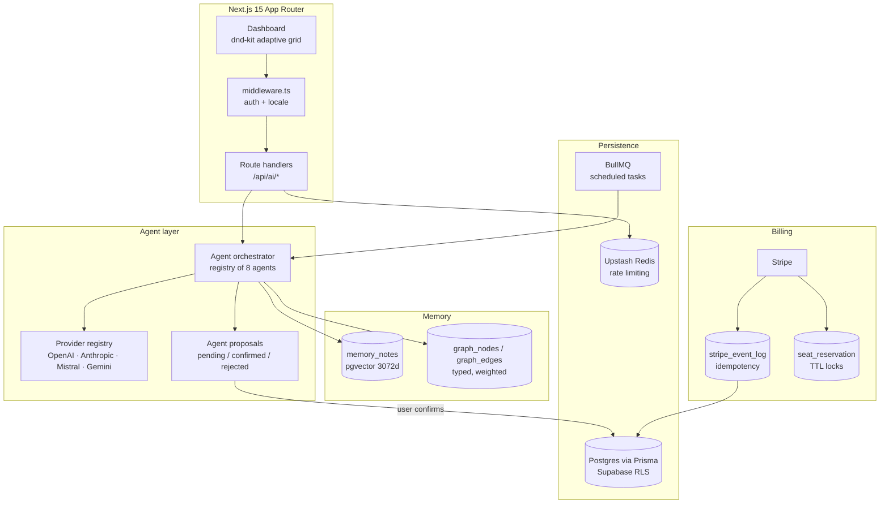
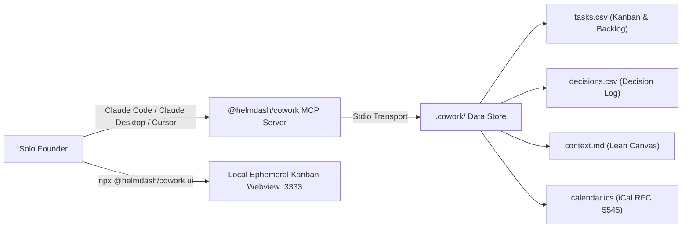

# Helmdash

An operating system for solo founders. Multi-provider AI agents that read your real business state (runway, pipeline, hypotheses, roadmap) and propose changes you approve before anything is written.

**Live:** [founderdashboard.vercel.app](https://founderdashboard.vercel.app)

`Next.js 15` · `React 19` · `TypeScript strict` · `Prisma` · `Postgres + pgvector` · `Supabase RLS` · `Vercel AI SDK` · `Stripe` · `BullMQ` · `Playwright`

---

## The problem

A solo founder holds finance, GTM, product, and research at once, with no one to delegate to and no one to check their reasoning. Generic AI chat does not help: it has no access to your actual numbers, it forgets everything between sessions, and it cannot act.

Helmdash is the other shape. Structured business state in Postgres, agents that read that state, and a write path that always goes through human approval.

---

## Architecture



---

## Engineering decisions

### Agents propose, they never write

An agent that mutates your finance table directly is a liability. Every agent action lands in an `agent_proposals` row carrying a domain, an action, a JSON payload, and a computed diff, with status `pending`. Nothing touches business tables until the user confirms.

This makes the whole agent layer auditable after the fact and safely reversible before it. It also means a bad model response is a rejected proposal instead of a corrupted runway calculation.

### Provider-agnostic agents through two registries

Agents and providers are separate registries. An `AgentDefinition` declares `buildSystemPrompt`, `buildUserMessage`, and `parseResponse` against a typed `AgentContext`. A `ProviderRegistry` resolves the caller's chosen model at execution time.

Adding a ninth agent is one registration call. Adding a fifth provider is one adapter. Neither touches the other. Users bring their own key and pick their own model per agent, which also moves inference cost off the platform and onto the user.

### Per-user envelope encryption for BYOK keys

User API keys are never stored in plaintext. Each user gets a random salt persisted in `user_encryption_keys`; the data key is derived from a master key plus that salt, and the provider key is encrypted under it. Compromising one user's ciphertext does not compromise another's, and key rotation is versioned in the same table.

### Hybrid memory: vectors for recall, a graph for structure

Semantic search alone loses relationships. `memory_notes` carries 3072-dimension embeddings for retrieval, while `graph_nodes` and `graph_edges` hold an explicit, typed, weighted knowledge graph (Concept, Person, Project, with relations like `RELATES_TO` and `CAUSED_BY`, uniqueness enforced on the triple).

Vectors answer "what is relevant". The graph answers "what depends on what". Agents need both.

### Billing built for the failure cases, not the happy path

- **Webhook idempotency.** Every Stripe event ID is recorded in `stripe_event_log` before processing, so redelivery is a no-op rather than a double charge.
- **Seat reservations with a TTL.** Cohort pricing is capped by seat count. A checkout session takes an expiring `seat_reservation` row, so two simultaneous buyers cannot oversell the last founder slot, and an abandoned checkout releases the seat automatically.
- **Cohort state on the user record.** `cohort`, `cohortRank`, `priceLockedForever`, and `cohortLockedUntil` make the pricing promise enforceable in the database rather than in marketing copy.

### Cost telemetry as a first-class table

`ai_cost_logs` records tokens, model, and estimated cost per call, scoped by feature (`onboarding`, `brief`, `chat`, `subagent`). `ai_usage` aggregates the same into monthly rows under a `(user, month, scope)` unique constraint.

Per-feature unit economics are a query, not an estimate. Plan limits read from a `plan_config` table, so changing a quota is a row update rather than a deploy.

---

## Companion Module: @helmdash/cowork & MCP Server

In addition to the cloud dashboard, the repository includes **`@helmdash/cowork`** (`packages/cowork`), an installable, local-first companion module that connects solo founder workflows directly to **Anthropic's Model Context Protocol (MCP)**, **Claude Code**, and **Claude Desktop**.



### Key Capabilities

1. **Native Model Context Protocol (MCP) Server (`cowork mcp`)** : Connects directly to Claude Desktop (`claude_desktop_config.json`) and Claude Code / Cursor (`.mcp.json`). Exposes typed project management tools without hallucinations:
   - `cowork_get_project_health` : Real-time pulse (MVP target countdown, Kanban task distribution, Top 3 daily focus, open dilemmas).
   - `cowork_get_project_context` : Reads the structured Lean Canvas, customer segment (ICP), and founder profile.
   - `cowork_get_tasks` & `cowork_add_task` : Typed Kanban operations with category, priority, and due dates.
   - `cowork_update_task_status` : Moves tasks across states (`todo`, `in_progress`, `blocked`, `done`), automatically updating `calendar.ics`.
   - `cowork_add_decision` : Consistently records strategic choices and architecture dilemmas into `decisions.csv`.
2. **Local-First & Git-Versioned (`.cowork/`)** : All data is stored in RFC 4180 CSV, Markdown, and standard RFC 5545 iCalendar (`calendar.ics`), protected by atomic file locking (`.lock`) and automatic schema migrations.
3. **Ephemeral Kanban Webview (`cowork ui`)** : Runs on `http://localhost:3333` with drag-and-drop task movement, and automatically terminates after **15 minutes of inactivity** to prevent background RAM exhaustion.
4. **Structured Onboarding Interview (`/cowork-onboard`)** : Equips Claude Code with Helmdash's 6 foundational founder questions and deterministic follow-up rules to frame any repository in minutes.

See [packages/cowork/README.md](packages/cowork/README.md) for full documentation, CLI commands, and schema specifications.

---

## Quality gates

CI runs on every PR into `main`. Beyond lint, typecheck, tests, and build, it enforces five checks that exist because of specific mistakes worth preventing.

| Gate | What it catches |
|---|---|
| **Type ratchet** | Compares `tsc --noEmit` error count against a committed baseline. Fails if the count rises, rewrites the baseline lower when it falls. Type debt can only shrink. |
| **Color ratchet** | Same mechanism for hardcoded hex and rgb values per file. Design tokens can only gain ground. |
| **Service role guard** | Greps client components and app routes for `SUPABASE_SERVICE_ROLE_KEY` and fails the build if it appears. A privilege-escalation class of bug, blocked mechanically. |
| **Live auth smoke test** | Boots the production build, then asserts that 13 AI, billing, and memory routes return 401 without a session cookie. Unauthenticated route regressions cannot merge. |
| **Landing claim lint** | Scans the marketing page and both locale files for feature claims the product does not ship (SSO, SLA, audit logs, unlimited agents, guaranteed). Roadmap-only terms are allowed inside the roadmap section and nowhere else. |

The last one is the one worth stealing. Marketing copy drifts ahead of the product by default. Here it is a build failure.

Two more scripts keep internationalization honest: a key-sync check across locale files, and a scanner that fails on hardcoded French strings in the source.

---

## Stack

| Layer | Choice |
|---|---|
| Framework | Next.js 15 App Router, React 19, TypeScript strict |
| Data | Prisma over Postgres (Supabase), pgvector, row-level security |
| AI | Vercel AI SDK, adapters for OpenAI, Anthropic, Mistral, Gemini; Genkit for flows |
| Async | BullMQ over Redis for scheduled agent runs, Upstash for rate limiting |
| Payments | Stripe with idempotent webhook handling |
| UI | Tailwind, Radix primitives, dnd-kit drag-and-drop grid, Recharts |
| i18n | next-intl, English and French, enforced by CI |
| Observability | Sentry, PostHog |
| Testing | Vitest with v8 coverage, Playwright end to end |
| Integrations | Composio MCP, Model Context Protocol (MCP) via `@helmdash/cowork` |

50 Prisma models across finance, CRM, GTM, roadmap, lean canvas, hypotheses, gamification, memory, and billing.

---

## Running locally

```bash
npm install                  # postinstall runs prisma generate
cp env.example .env.local    # Supabase, Stripe, and at least one AI provider key
npx prisma migrate deploy
npm run dev                  # http://localhost:9002
```

```bash
npm run typecheck            # type ratchet
npm test                     # vitest
npm run test:e2e             # playwright
npm run build                # color ratchet, then next build
```

---

## Layout

```
packages/cowork/     Local-first companion CLI & Model Context Protocol (MCP) Stdio server
src/lib/ai/          Agent orchestrator, provider registry, BYOK key encryption
src/app/(app)/       Authenticated dashboard
src/app/(marketing)/ Public landing, claim-linted
src/app/api/         Route handlers, all session-gated
prisma/schema.prisma 50 models
scripts/             Ratchets, auth smoke test, claim lint, i18n sync
tests/               Vitest unit and integration
messages/            en.json, fr.json, key-synced in CI
```

---

## Status

Pre-launch. Waitlist open, cohort pricing live, target launch September 2026. Built and shipped solo.

## License

See [LICENSE](LICENSE). Security policy in [SECURITY.md](SECURITY.md).
